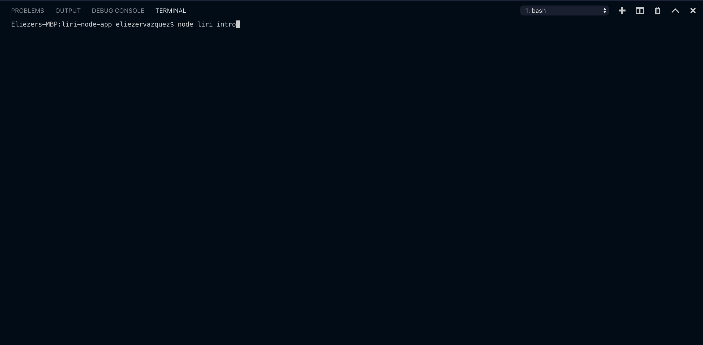
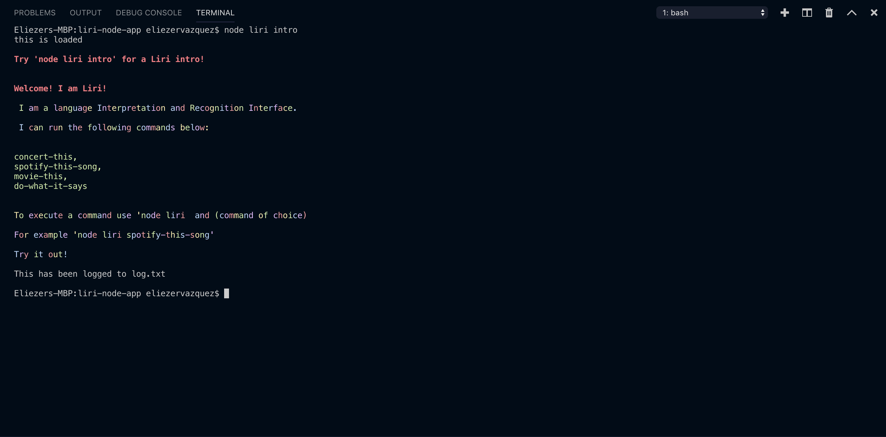
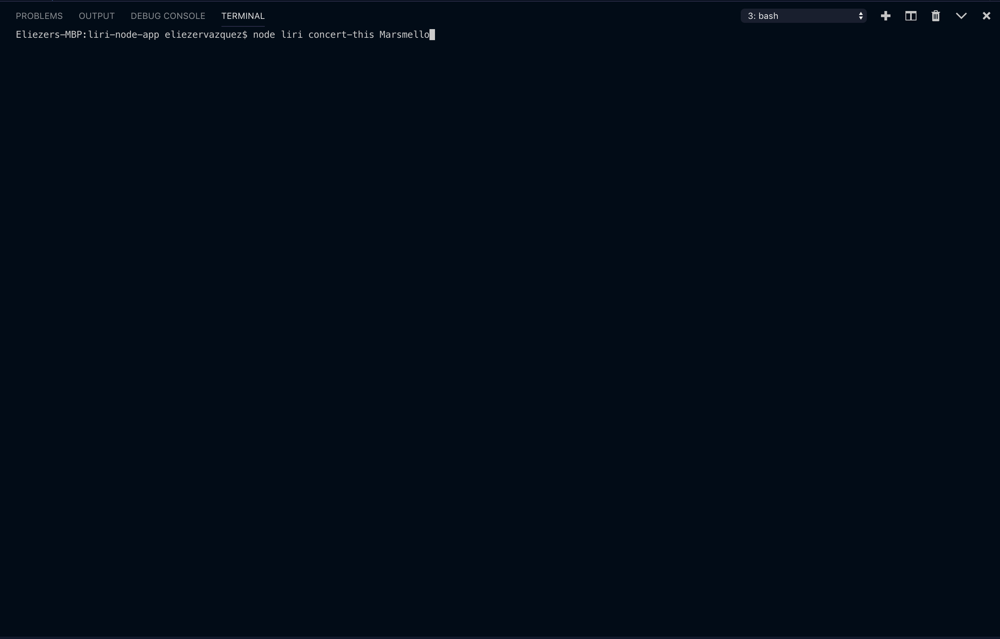
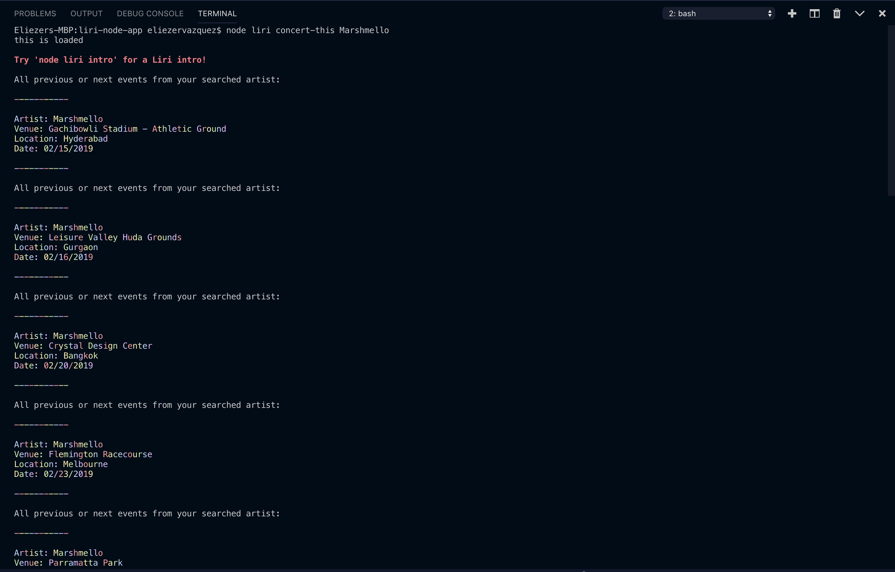
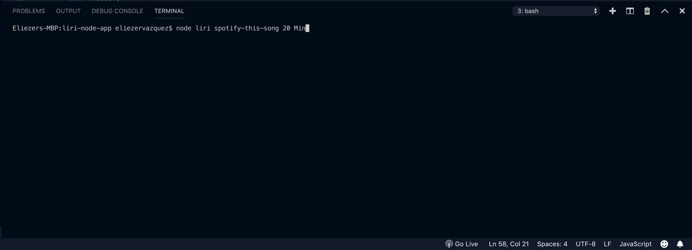
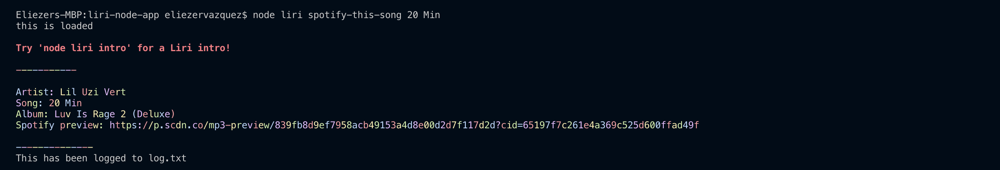
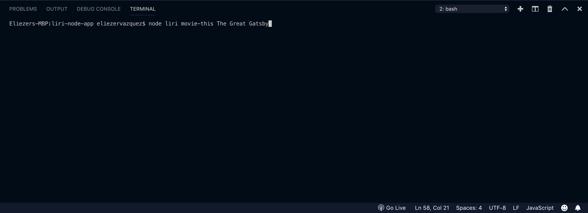
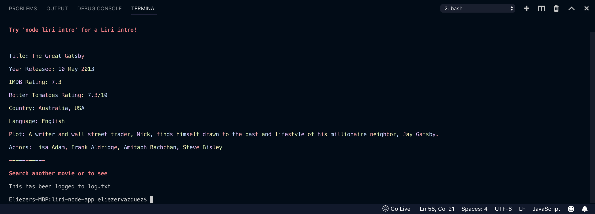
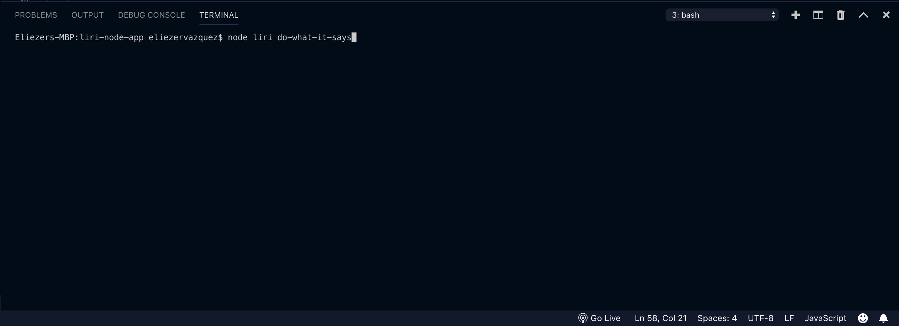
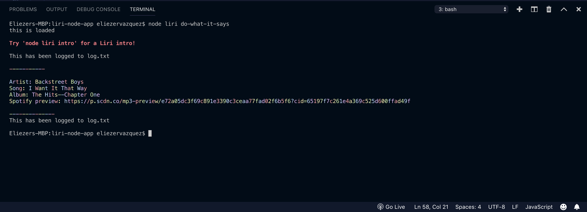

# liri-node-app

LIRI ("Language Interpretation and Recognition Interface") is simple command line node app that can pull information from the Spotify, Alpha Vantage, and OMDB APIs and return information neatly for the user.

For Spotify track information, use

node liri spotify-this-song "<song name here>"
to return song name, album, artists, the url for the spotify song preview. By default, the program will display The Sign by Ace of Base if no song is provided.

For movie information, use

node liri movie-this "<movie name here>"
to return movie name, release year, imdb and rotten tomatoes ratings, the country of release, the language, plot and hte actorsd of the film.

For stock information, use

node liri stock-this "<stock symbol here>"
to return the latest stock information about the symbol provided.

Otherwise, you can use

node liri do-what-it-says
which reads a command from the random.txt file and executes it

